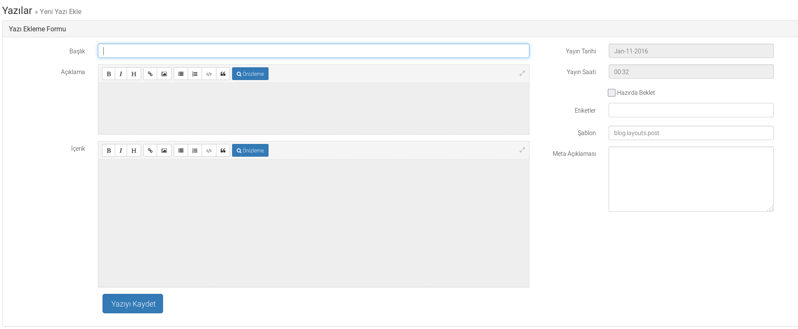
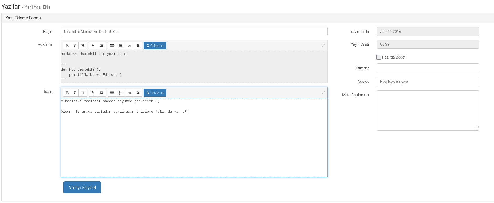
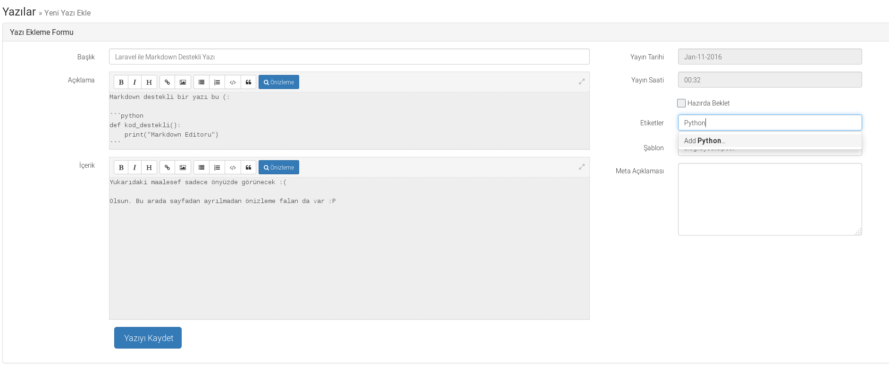
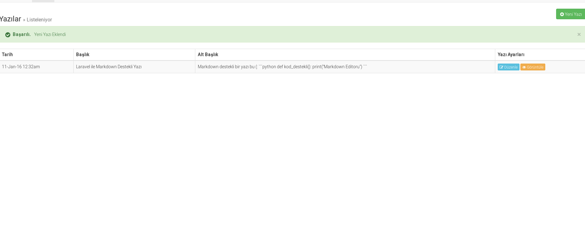
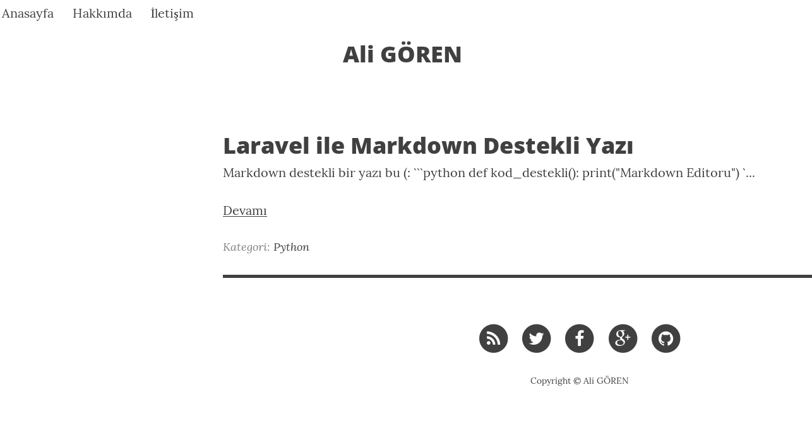
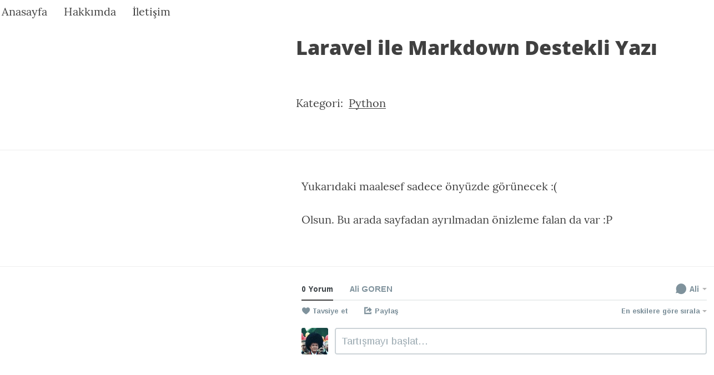
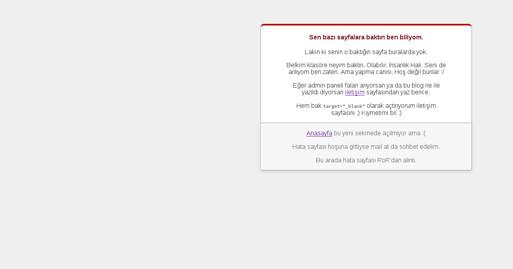

# Larablog Basit Blog uygulaması

Öncelikle `php artisan migrate` komutunu verelim. Daha sonra `php artisan tinker` komutunu verelim. Kullanıcı eklemek için:

```php
php artisan tinker

$user = new App\User;

$user->name = 'Ali'; // Adınız

$user->email = 'mail@adresiniz.com'; // Bu mail ile giriş yapacaksınız.

$user->password = bcrypt('ŞİFRENİZ'); // Bu kısma şifrenizi yazın. Yönetim paneli için gerekli.

$user->save(); // Kullanıcıyı kaydetmiş oluyorsunuz.

exit;
```

Eğer PHP 7 kullandığınız için tinker sıkıntısı alırsanız herhangi bir blade dosyasına yukarıdaki kodlar yazıp tarayıcıda o sayfayı çağırmanız yeterlidir. Örneğin;

```php
Route::get('/tinker', function() {
    return View::make('tinker');
}
```

şeklinde yapıp tinker.blade.php dosyasına tinker adımlarındaki kodları eklersiniz. Sonra `http://localhost/tinker` çağrısı ile kullanıcı oluşturmuş olursunuz.

Hepsi bittikten sonra da

`php artisan serve` komutunu vererek localde test edebilirsiniz. ( screenshots klasöründe farklı görseller var mı bilmiyorum )

**Özellikler**

Resim yüklenebiliyor. Kategori (Etiket) özelliği var.

Markdown destekli. Yazı eklerken markdown editörü aktif.



Markdown klavye kısayolları aktiftir. Bootstrap Markdown kullandım.



Ön yüz için açıklama yazısı yazılabiliyor.

Etiketlerde Jquery'den fayda edildi. Etiket kısmına tıklandığında önceden ekli etiket var ise o etiketleri gösteriyor.
Yok ise eklerken görüntüdeki gibi seçenek sunuyor.



Yazılar tablo halinde şöyle listeleniyor:



Ön yüzde herhangi bir kod çalışmayacak. Oraya kod eklemeseniz daha iyi olur. Devamını oku kısmını oraya ekledim.



Yazı sayfası şöyle görünüyor:



Mümkün olduğunda hatadan uzak durun :P Hata sayfasını RoR abiden çaldım.


